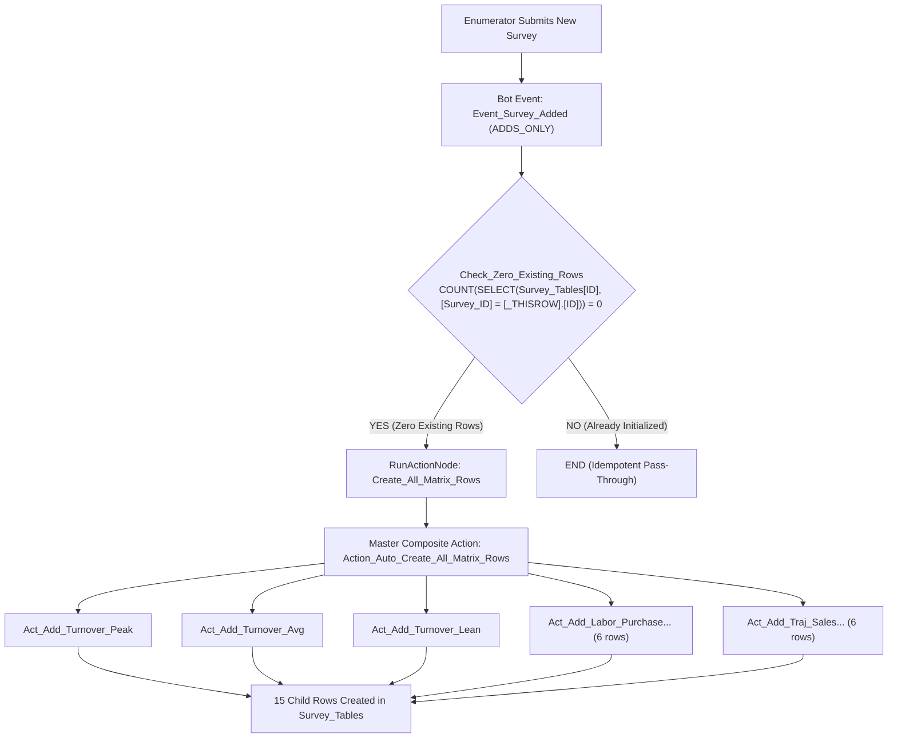

# AU-014: Autonomous Matrix Pre-Population via Composite Actions & Idempotency Bots

> **Category:** Automations / Multi-Table Workflows  
> **Target:** AppSheet Modern Editor & C# Backend  
> **Status:** Production Standard  

---

## 1. Problem Description
Complex enterprise survey instruments (e.g. baseline socio-economic studies, MSME diagnostics) contain multiple matrix or grid questions (e.g. Seasonal Turnover across 3 seasons, Operational Labor across 6 functions, Business Trajectory across 6 financial metrics).

Requiring field enumerators to click **"Add New"** 15 to 30 times per survey creates:
- Severe field fatigue and enumerator errors.
- Inconsistent row naming and typos.
- Missing rows that invalidate statistical analysis.

---

## 2. Architectural Solution



---

## 3. C# Backend Redux Invariants

When injecting this architecture via browser console Redux:

### 1. Add Row Action (`ADD_RECORD_TO`)
- `ActionType`: `"ADD_RECORD_TO"`
- `ActionDefinition.$type`: `"Jeenee.DataTypes.DataActionAddRowTo, Jeenee.DataTypes"`
- `ReferencedTable`: Name of the child table (e.g. `"Survey_Tables"`).
- `Assignments`: Array of `{ Column: "...", Value: "..." }`.
- Invariant: Root action wrapper must NOT contain top-level `$type`.

### 2. Composite Grouped Action (`COMPOSITE`)
- `ActionType`: `"COMPOSITE"`
- `ActionDefinition.$type`: `"Jeenee.DataTypes.DataActionComposite, Jeenee.DataTypes"`
- `Actions`: Array of `{ ActionName: "..." }`.

### 3. Process Node (`RUN_ACTION`)
- `NodeType`: `"RUN_ACTION"`
- `$type`: `"Jeenee.DataTypes.ProcessNodes.RunActionNode, Jeenee.DataTypes"`
- `Action`: Name of the composite action.
- Mandatory fields: `"ExprLookup": {}`, `"InputAssignments": []`, `"OutputTableName": null`, `"Comment": null`, `"IsValid": true`, `"Visibility": "ALWAYS"`, `"DisableAutoUpdate": false`.

---

## 4. Idempotency Formula
To prevent duplicate rows if a survey record is edited after submission:
```appsheet
COUNT(SELECT(Survey_Tables[ID], [Survey_ID] = [_THISROW].[ID])) = 0
```
This guarantees that only truly newly created surveys trigger child row generation.
