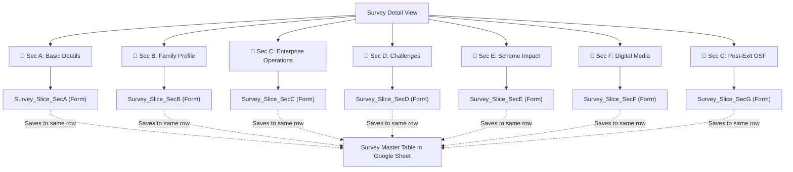

# OmmNoMi AppSheet Survey: 7 Section Navigation & Slices Architecture

This document defines the complete architecture for the 7 Section Navigation Buttons and their corresponding Form Slices, allowing surveyors to fill the survey section-by-section without feeling overwhelmed by 227 questions.

---

## 1. Architecture Overview

---

## 2. The 7 Slices Definition

In AppSheet Editor > **Data > Slices > Add New Slice**:

| Slice Name | Source Table | Slice Filter Formula | Slice Columns |
| :--- | :--- | :--- | :--- |
| **`Survey_Slice_SecA`** | `Survey` | `TRUE` | `ID`, `Status_Profile`, `SEC_A_HEADER`, `District`, `Block`, `VillageGP`, `RespondentName`, `ContactNumber`, `SHGName`, `VOName`, `CLFName`, `SHGMembershipYears`, `LeadershipRole`, `LeadershipYears`, `RelatedToCRP`, `EPInterventionType`, `EnterpriseName`, `ParallelEnterpriseName`, `EnterpriseSetupYear`, `LoanReceivedYear`, `BusinessType`, `BusinessActivities`, `BusinessActivitiesOther` |
| **`Survey_Slice_SecB`** | `Survey` | `TRUE` | `ID`, `Status_Profile`, `SEC_B_HEADER`, `RespondentAge`, `MaritalStatus`, `SocialCategory`, `EducationStatus`, `FamilyMemberCount`, `FamilyAdultsCount`, `FamilyChildrenCount`, `FamilyTotalEarning`, `FamilyMaleEarning`, `FamilyFemaleEarning`, `FamilyDisabledCount`, `FamilyIncomeSources`, `AnnualHouseholdIncome` |
| **`Survey_Slice_SecC`** | `Survey` | `TRUE` | `ID`, `Status_Operations`, `SEC_C_HEADER`, All Section C Questions (Reasons, Labor Matrix, Sourcing, Marketing, Turnover, Capital Arranged, 14 Capital Sources, Trajectory Changes, Financial Help) |
| **`Survey_Slice_SecD`** | `Survey` | `TRUE` | `ID`, `Status_Challenges`, `SEC_D_HEADER`, `HusbandFamilyResponse`, `MaterialSourcingComfort`, `CustomerPaymentRecovery`, `FundingExperience`, `CurrentChallenges`, `Challenge_OSFPhasedOutAmt`, `Challenge_ScaleUpFundAmt`, `Challenge_RenovationFundAmt`, `Challenge_TimelyInputsAmt`, `Challenge_InventoryHelpAmt`, `Challenge_Other` |
| **`Survey_Slice_SecE`** | `Survey` | `TRUE` | `ID`, `Status_SchemeImpact`, `SEC_E_HEADER`, `AttendedTraining`, `TrainingDetails`, `UsedTrainingComponent`, `UsedTrainingDetails`, `MonthlyIncomeBeforeLoan`, `MonthlyIncomeAfterLoan`, `CRPContributions`, `CRPContributionDocDetails`, `ExpectationsFromScheme` |
| **`Survey_Slice_SecF`** | `Survey` | `TRUE` | `ID`, `Status_Digital`, `SEC_F_HEADER`, `SmartphoneOwnership`, `UseQRUPI`, `QRDailyTransactions`, `QRNonUseReason`, `SocialPlatformsUsed`, `SocialPlatformUsageMode`, `SocialMediaFrequency` |
| **`Survey_Slice_SecG`** | `Survey` | `IN([District], LIST("Baran", "Churu"))` | `ID`, `Status_PostExit`, `SEC_G_HEADER`, `OSFInterventionYear`, `BusinessOperationalStatus`, `BusinessClosureYear`, `ScalingDownClosingReasons`, `ScalingDownOtherReason`, `SupportNeededForSustenance`, `SupportNeededOther` |

---

## 3. The 7 Form Views

In AppSheet Editor > **App > Views > Add New View**:

1. **`Survey_Form_SecA`**: Table = `Survey_Slice_SecA`, View Type = `Form`
2. **`Survey_Form_SecB`**: Table = `Survey_Slice_SecB`, View Type = `Form`
3. **`Survey_Form_SecC`**: Table = `Survey_Slice_SecC`, View Type = `Form`
4. **`Survey_Form_SecD`**: Table = `Survey_Slice_SecD`, View Type = `Form`
5. **`Survey_Form_SecE`**: Table = `Survey_Slice_SecE`, View Type = `Form`
6. **`Survey_Form_SecF`**: Table = `Survey_Slice_SecF`, View Type = `Form`
7. **`Survey_Form_SecG`**: Table = `Survey_Slice_SecG`, View Type = `Form`

*Set **Event Actions > Form Saved** to `LINKTOROW([ID], "Survey_Detail")` so it returns cleanly to the Master Detail card.*

---

## 4. The 7 Action Buttons on `Survey_Detail`

In AppSheet Editor > **App > Actions**:

### Button 1: Section A
* **Action Name**: `Open_Section_A`
* **For a record of table**: `Survey`
* **Do this**: `App: go to another view within this app`
* **Target**: `LINKTOROW([ID], "Survey_Form_SecA")`
* **Prominence**: `Display prominently`
* **Display Name**: `IF([Status_Profile] = "Complete", "✅ Sec A: Basic Details", "🔘 Sec A: Basic Details")`
* **Icon**: `file-text`

### Button 2: Section B
* **Action Name**: `Open_Section_B`
* **Target**: `LINKTOROW([ID], "Survey_Form_SecB")`
* **Prominence**: `Display prominently`
* **Display Name**: `IF([Status_Profile] = "Complete", "✅ Sec B: Family Profile", "🔘 Sec B: Family Profile")`
* **Icon**: `users`

### Button 3: Section C
* **Action Name**: `Open_Section_C`
* **Target**: `LINKTOROW([ID], "Survey_Form_SecC")`
* **Prominence**: `Display prominently`
* **Display Name**: `IF([Status_Operations] = "Complete", "✅ Sec C: Operations", "🔘 Sec C: Operations")`
* **Icon**: `briefcase`

### Button 4: Section D
* **Action Name**: `Open_Section_D`
* **Target**: `LINKTOROW([ID], "Survey_Form_SecD")`
* **Prominence**: `Display prominently`
* **Display Name**: `IF([Status_Challenges] = "Complete", "✅ Sec D: Challenges", "🔘 Sec D: Challenges")`
* **Icon**: `alert-circle`

### Button 5: Section E
* **Action Name**: `Open_Section_E`
* **Target**: `LINKTOROW([ID], "Survey_Form_SecE")`
* **Prominence**: `Display prominently`
* **Display Name**: `IF([Status_SchemeImpact] = "Complete", "✅ Sec E: Schemes", "🔘 Sec E: Schemes")`
* **Icon**: `award`

### Button 6: Section F
* **Action Name**: `Open_Section_F`
* **Target**: `LINKTOROW([ID], "Survey_Form_SecF")`
* **Prominence**: `Display prominently`
* **Display Name**: `IF([Status_Digital] = "Complete", "✅ Sec F: Digital Media", "🔘 Sec F: Digital Media")`
* **Icon**: `smartphone`

### Button 7: Section G
* **Action Name**: `Open_Section_G`
* **Target**: `LINKTOROW([ID], "Survey_Form_SecG")`
* **Prominence**: `Display prominently`
* **Display Name**: `IF([Status_PostExit] = "Complete", "✅ Sec G: Post-Exit", "🔘 Sec G: Post-Exit")`
* **Icon**: `log-out`
* **Only if this condition is true**: `IN([District], LIST("Baran", "Churu"))`
