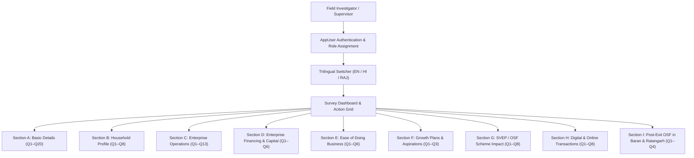

# CmF & RAJEEVIKA Study: Performance of SHG-Led Women Entrepreneurs in Rajasthan
## Complete AppSheet Application & Survey Engine Specification

**Application Name:** `SHG_Women`  
**App ID:** `0ec93d78-96d5-487c-87ce-742b3b558a3f`  
**Client Organization:** Centre for microFinance (CmF) & RAJEEVIKA  
**Engineering Firm:** OmmNoMi Automation LLP  
**Supported Languages:** 🇮🇳 English (`LANG_EN`), हिन्दी (`LANG_HI`), राजस्थानी (`LANG_RAJ`)  
**Currency Standard:** Indian Rupees (`₹` / `INR`)  

---

## 1. System Architecture Overview

The application is structured into a dynamic, modular, and multi-matrix survey engine designed for field investigators collecting high-fidelity data across 5 target districts of Rajasthan (Baran, Churu, Dausa, Dungarpur, Jodhpur).

---

## 2. Comprehensive Section-by-Section Data Dictionary

### Section A: Basic Details (Q1 – Q20)
- **Q1 – Q3 Geography:** Cascading selectors for `District` (5 districts: Baran, Churu, Dausa, Dungarpur, Jodhpur), `Block` (10 blocks with parent filtering), `VillageGP`.
- **Q4 – Q5 Respondent Demographics:** `RespondentName`, `ContactNumber` (Phone).
- **Q6 – Q8 Institutions:** `SHGName`, `VOName`, `CLFName`.
- **Q9 – Q11 Leadership Experience:** `SHGMembershipYears` (Number), `LeadershipRole` (Enum: Yes/No), `LeadershipYears` (Number).
- **Q12 – Q13 Scheme Linkage:** `RelatedToCRP` (Enum: Yes/No), `EPInterventionType` (SVEP, OSF, OSF phased out, Don't know).
- **Q14 – Q15 Enterprise Identity:** `EnterpriseName`, `ParallelEnterpriseName`, `EnterpriseSetupYear` (Year/Number).
- **Q16 – Q17 Business Type & Activities:** `BusinessType` (Trading, Servicing, Manufacturing), `BusinessActivities` (26+ specific rural trade activities including Flour mill, Tailoring, Beauty parlour, Sanitary napkin, Dairy collection, Food processing, etc.).
- **Q18 – Q20 Compliance & Records:** `LoanReceivedYear`, `MaintainSeparateRecords` (Enum: Yes/No), `RegistrationType` (PAN, Aadhar, Udyam Aadhar, Shop & Est., FSSAI, Caste, Income).

---

### Section B: Respondent & Household Profile (Q1 – Q8)
- **Q1 – Q4 Socio-Demographics:** `RespondentAge` (18-25, 26-35, 36-45, 46-55, >55), `MaritalStatus` (Single, Married, Widowed, Separated, Divorced), `SocialCategory` (SC, ST, OBC, General), `EducationStatus` (Illiterate to B.Ed).
- **Q5 – Q6 Family Composition:** `FamilyMemberCount` (Total count), `FamilyAdultsCount`, `FamilyChildrenCount`, `FamilyTotalEarning`, `FamilyMaleEarning`, `FamilyFemaleEarning`, `FamilyDisabledCount`.
  - *Validation Rule:* `([FamilyAdultsCount] + [FamilyChildrenCount]) <= [FamilyMemberCount]`.
- **Q7 – Q8 Income Profiling:** `FamilyIncomeSources` (EnumList of 12+ sources including Livestock sale), `AnnualHouseholdIncome` (10 brackets from `< ₹80k` up to `Above ₹4,00,001`).

---

### Section C: Enterprise Operations (Q1 – Q13)
- **Q1 – Q5 Operational Foundations:** `ReasonsStartingBusiness` (8 motives + specify), `BusinessCycle` (6 operational cycles), `BusinessPlaceType` (Own/Rented), `AnnualRent` (Numeric in ₹), `LocationConvenience` (5 convenience evaluations).
- **Q6 Labor & Resource Matrix:** Granular involvement level (Regular, Occasional, Only Respondent, N/A), family count, hired count, and amount paid (in ₹) across 6 core activities:
  1. Purchase of material
  2. Production / manufacturing
  3. Servicing
  4. Social media marketing
  5. Sales (shop/door-to-door/haat)
  6. Record keeping
- **Q7 – Q10 Sourcing & Marketing:** `Sourcing_xxx_Pct` (Nearby town, Jaipur, Outside state, Online), `MarketingMethods` (Shop board, Samples, WhatsApp, etc.), `SeasonalSalesMethod`, `SalesChannel_xxx_Pct` (Online, WhatsApp, Instagram, Premise, Traders, Haat, Saras fair).
- **Q11 – Q13 Record Keeping & Turnover:** `RecordKeepingHabit`, `RecordKeepingMethod` (Receipt book, Daily diary, CRP diary, Bahi-Khata app, etc.), `Survey_Turnover` child table (Peak, Average, Lean seasons with duration in integer months, monthly sales in ₹, monthly net profit in ₹).

---

### Section D: Enterprise Financing & Capital (Q1 – Q6)
- **Q1 SHG Association Assistance:** Multiselect benefits received (Training, loan, subsidy, CRP guidance, Mudra/Bank loan assistance).
- **Q2 Capital Arrangement Matrix:** 14 distinct capital sources tracked across First Year, In-between Years, Current Year (2026-27), and Pending Balances (with ₹0 pre-filled default):
  - *Sources:* Own Savings, Family member, Business profit, Mortgaged gold, Sold gold, Family loan, Moneylender, SHG loan, OSF/SVEP loan, OSF subsidy, Private saving group/BC, NBFC, Mudra loan, Bank loan.
- **Q3 Loan Usage Mapping:** Direct linkage of each activated loan source to specific enterprise utilization purposes (Seed capital, Machine purchase, Asset storage/fridge, Space expansion, Stock range, Vehicle, Smartphone).
- **Q4 – Q6 Growth Trajectory & Financial Well-being:** `FundingExperience`, `Trajectory_xxx` (Sales, Income, Stock, Assets comparison), `FinancialHelpFromIncome` with specific amounts in ₹:
  - `FinancialHelp_EducationAmt`
  - `DebtRepaidAmount`
  - `AssetsAcquiredAmount`
  - `MarriageExpensesAmount`

---

### Section E: Ease of Doing Business & Challenges (Q1 – Q6)
- **Q1 – Q4 Operational Environment:** `HusbandFamilyResponse` (6-tier support spectrum), `MaterialSourcingComfort` (autonomy & travel), `CustomerPaymentRecovery` (cash only, recovery experience, bad debt impact), `CurrentChallenges` (with deficit amounts in ₹).
- **Q5 – Q6 Market Competition:**
  - `Competitors_Similar_Scale` (Number of village peers with similar scale)
  - `Competitors_Smaller_Scale` (Number of village peers with smaller scale)
  - `Competitors_Higher_Scale` (Number of village peers with larger scale)
  - `CompetitorAdvantages` (10 competitive edges: Location, Shop vs Home, Variety, Discount margins, Quality, Delivery, etc.)

---

### Section F: Growth Plans & Aspirations (Q1 – Q3)
- **Q1 1-Year Scale Plans:** 14 strategic growth choices (`FutureExpansionPlans` - shift location, renovate premise, expand stock, add new products, hire workers, digital selling, etc.).
- **Q2 Growth Bottlenecks:** `AspirationBottlenecks` (Lack of capital, household time constraints, demand access, skill gap, loss risk, etc.).
- **Q3 Funding Requirements:** `FutureFundsRequired` (Upto ₹1L, ₹1L–₹3L, ₹3L–₹5L, ₹5L–₹7L, ₹7L–₹9L, >₹9L).

---

### Section G: SVEP / OSF Scheme Impact (Q1 – Q8)
- **Q1 – Q6 Training & Income Transformation:** Training attendance, trade components used, monthly income pre/post loan, income rise bracket (`MonthlyIncomeIncreaseByOSFSVEP`).
- **Q7 – Q8 CRP Contribution & Scheme Expectations:**
  - `CRPContributions` (Subsidy, Documentation, Business plans, Profit ideas, Records, Instagram learning, Competitor analysis).
  - `ExpectationsFromScheme` (EnumList of 8 expectations: Bigger loans, Mudra assistance, SBDP guidance, Market linkage, Instagram training, Trade-specific workshops).

---

### Section H: Digital & Online Transactions (Q1 – Q8)
- **Q1 – Q4 Digital Finance:** `SmartphoneOwnership` (Own / Husband / Shared / None), `UseQRUPI` (Yes/No), `QRDailyTransactions` (Brackets: 1-4, 5-10, 10-20, 20-40, >40), `QRNonUseReason` (including "Not applicable").
- **Q5 – Q8 Social Media Channels:** `SocialMediaForMarketing`, `SocialPlatformsUsed` (WhatsApp, Instagram, Pinterest, Facebook, Snapchat), `SocialPlatformUsageMode` (Catalog, price enquiries, vendor connection), `SocialMediaFrequency` (Daily, Weekly, Monthly, Occasional).

---

### Section I: Post-Exit OSF in Baran & Ratangarh (Q1 – Q4)
- **Q1 – Q4 Long-Term Sustainability:** `OSFInterventionYear`, `BusinessOperationalStatus` (Reduced, Increased, Same, Closed + Year), `ScalingDownClosingReasons` (Lack of guidance, loan deficit, bank refusal, competition), `SupportNeededForSustenance` (Continued loan access, ongoing CRP support).

---

## 3. Database & AppSheet Configuration Summary

| Layer | Component | Status | Verification Note |
|---|---|---|---|
| **Google Sheets** | `Survey` Sheet | **144 Columns** | Includes all 14 newly added physical columns & metrics. |
| **Google Sheets** | `AppVariables` Sheet | **697 Rows** | Full trilingual data layer (English, हिन्दी, राजस्थानी). |
| **AppSheet Redux** | DataSchemas & Attributes | **109 Core Attributes** | Regenerated and fully mapped. |
| **AppSheet Redux** | Currency Formatting | **₹ (INR)** | Enforced across all Price / Decimal columns (replacing `$`). |
| **AppSheet UX** | Slices & Controls | Active | Section Headers (SEC_A to SEC_I) and ActionGrid navigation. |
| **AppSheet Backend** | C# Deserializer Safety | 100% Compliant | Zero `Error 400` risks (`Jeenee.DataTypes`). |
